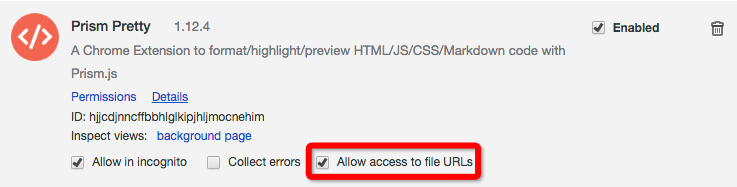

[Prism Pretty](https://github.com/L3au/Prism-Pretty)
===

A Chrome Extension to format/highlight/preview HTML/JS/CSS/Markdown code with Prism.js

Install
---
[Chrome Web Store](https://chrome.google.com/webstore/detail/prism-pretty/hjjcdjnncffbbhlglkipjhljmocnehim)

Allow local files
---

Features
---
- Precise detect
- 3 Pretty Themes
- HTML、JS、CSS、JSON、JSONP support
- Show response headers
- Transform unicode to text
- Custom CSS setting
- CSS properties preview
- Markdown file preview

Change Log
---

- v1.14.2
  - fix chrome charset

- v1.14.1
  - fix Promise.defer missing

- v1.14.0
  - some bugs fix
  - experience improved

- v1.12.12
  - features improved...

- v1.12.4
  - rm github csp alteration
  - change enabled adjust

- v1.12.2
  - fix js code detect

- v1.12.1
  - fix response headers style

- v1.12.0
  - performance improved
  - other changes

- v1.11.4
  - fix a potential fatal bug...

- v1.11.1
  - modify content fetch
  - fix scroll background

- v1.10.0
  - add markdown preview
  - add format types setting
  - add Droid Sans Mono font
  - fix some bugs

- v1.0.8
  - fix json/jsonp parse
  - fix contextMenus duplicated
  - change headers getting method from HEAD to GET

- v1.0.7
  - add html pretty
  - add contextMenu Prism Page Source

- v1.0.6
  - more efficient & lower memory using

- v1.0.5
  - move request header to background

- v1.0.4
  - update options setting

- v1.0.3
  - fix initial icon status

- v1.0.2
  - bugfix

- v1.0.1
  - fix githubusercontent.com csp
  - show request headers
  - add css preview

- v1.0.0
  - initial version
